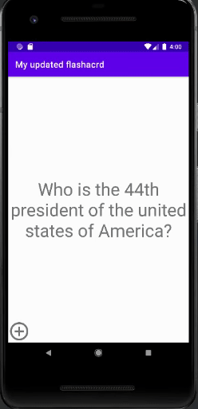

## FLASHCARD_APP

## Lab 1

### Flashcard_app
`TODO://` An app that displays a flashcard and allows users to ask other users questions
 

## Required
- [x] User can click on a ‘+’ button that takes the user to new ‘Add Card Screen’
- [x] The 'Add Card Screen' has a cancel button to take the user back to the main screen
- [x] User can enter and submit a Question and Answer through the 'Add Card Screen'
- [x] User will see the card they just created on the main screen when they press the 'Save Button'
- [x] Push your progress to GitHub!

## Optional
- [ ] User can edit a card
- [ ] An error message is shown if the user doesn't enter both a Question and an Answer
- [ ] A notification is shown if the card was created successfully
- [ ] User can also enter multiple choice answers when creating a card
- [ ] App is further styled and customized!